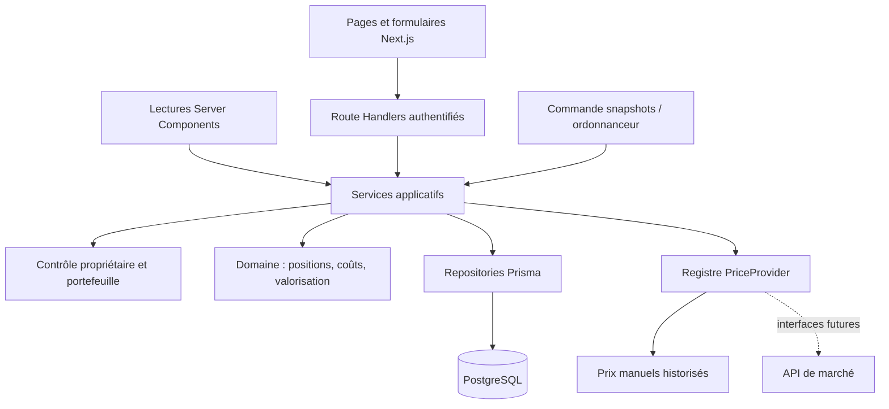

# Architecture proposée

Ce document conserve l’architecture cible définie avant le développement. La version locale 0.1.0 est maintenant implémentée. Consulter [les choix réellement livrés et leurs écarts](implementation.md) et [la roadmap à jour](roadmap.md) avant de considérer une capacité ci-dessous comme disponible. Voir aussi le [modèle de données cible](data-model.md), les [calculs](calculations.md) et le [contrat API cible](api.md).

## 1. Périmètre et hypothèses

| Question | Décision par défaut | Évolution prévue |
| --- | --- | --- |
| Usage personnel ou partagé ? | Un utilisateur et un portefeuille dans l'interface | Toutes les données sont rattachées à un propriétaire et un portefeuille |
| Saisie initiale ? | Manuelle et import CSV validé | Adaptateurs d'import externes ultérieurs |
| Prix automatiques ? | Prix manuels, démonstration fictive isolée | Connecteurs crypto, titres, métaux et cartes via interfaces |
| Devises ? | Référence EUR, affichage EUR ou USD | Devises supplémentaires par table de référence |
| Gains et fiscalité ? | Coût moyen économique, gains réalisés et latents | Moteur fiscal distinct ultérieur |
| Hébergement ? | Local en premier, Docker Compose | Node.js + PostgreSQL sur la cible choisie plus tard |
| Langue et dates ? | Interface française ; fuseau Europe/Paris configurable | UTC en base ; fuseau du portefeuille pour les journées |
| Liquidités ? | Soldes EUR/USD internes au suivi | Comptes purement déclaratifs, aucune connexion bancaire |

Les liquidités sont nécessaires pour que dépôts, retraits, ventes et dividendes aient une contrepartie cohérente. Une vente conservée dans le portefeuille transforme un actif en liquidités ; elle ne fait pas disparaître sa valeur. Les achats peuvent être financés par ces liquidités ou par un apport extérieur explicite.

Les prix de démonstration seront signalés comme fictifs. Aucun compte bancaire, exchange, wallet ou courtier ne sera connecté et aucun ordre ne sera envoyé. Les intégrations financières et l'hébergement effectif sont hors de cette phase.

## 2. Choix techniques

| Couche | Choix | Motif |
| --- | --- | --- |
| Application | Next.js 16, App Router, runtime Node.js | Pages et API dans un même projet, déployable comme serveur Node |
| Langage | TypeScript strict | Contrats explicites entre formulaires, API et domaine |
| UI | Tailwind CSS et shadcn/ui | Composants accessibles et personnalisation sobre |
| Formulaires | React Hook Form et Zod | Schémas partagés ; revalidation serveur obligatoire |
| Graphiques | Recharts | Courbes temporelles et répartition avec tableaux alternatifs |
| Persistance | PostgreSQL 17 | Relations, contraintes, transactions et nombres décimaux |
| ORM | Prisma 7 + adaptateur PostgreSQL | Modèle typé, client et migrations inspectables |
| Calculs | decimal.js, précision interne 60 chiffres | Éviter les calculs monétaires en `number` |
| Authentification | Better Auth + adaptateur Prisma | Mot de passe local, sessions persistantes et évolution possible |
| Tests | Vitest, PostgreSQL de test, Playwright | Domaine, intégration réelle et parcours navigateur |
| Exécution | Node.js 24, pnpm, Docker Compose | Environnement reproductible local et CI |

Les versions exactes compatibles seront choisies et verrouillées à la phase 1 dans `package.json`, `pnpm-lock.yaml` et les images Docker. Ne pas dépendre de `latest` dans les builds reproductibles. Prisma CLI, client et adaptateur doivent rester alignés.

La documentation officielle fournit un [parcours Better Auth / Next.js explicitement compatible avec Prisma 7](https://www.prisma.io/docs/guides/authentication/better-auth/nextjs). Cette compatibilité motive le choix de cette branche, plutôt qu'une migration opportuniste d'ORM. PostgreSQL 17 figure dans les [bases prises en charge par Prisma](https://docs.prisma.io/docs/orm/reference/supported-databases).

La stack Node.js/PostgreSQL demandée reste prioritaire. Pas de conversion du projet vers un starter de site hébergé, pas de publication pendant le cadrage.

## 3. Organisation : monolithe modulaire



Le domaine est constitué de fonctions pures ; il n'importe ni Next.js, ni Prisma, ni une API de marché. Les services réalisent les cas d'usage et contrôlent les autorisations. Les repositories centralisent les requêtes filtrées par propriétaire et portefeuille. Les Route Handlers restent courts : session, validation, service et sérialisation.

Les Server Components appellent les mêmes services de lecture directement, sans requête HTTP vers leur propre application. Le navigateur effectue ses mutations via l'API. On évite de dupliquer les règles dans des Server Actions et dans les Route Handlers.

Structure cible, **non encore créée** :

```text
src/
  app/
    (auth)/login/page.tsx
    (private)/dashboard/page.tsx
    (private)/portfolio/page.tsx
    (private)/assets/{page.tsx,new/page.tsx,[id]/page.tsx}
    (private)/transactions/{page.tsx,new/page.tsx}
    (private)/history/page.tsx
    (private)/settings/page.tsx
    api/auth/[...all]/route.ts
    api/v1/...
  components/{ui,layout,charts,forms}/
  modules/
    assets/{schemas,service,repository}.ts
    transactions/{schemas,service,repository}.ts
    valuation/{service,repository}.ts
    prices/{contracts,registry,service,providers}/
    snapshots/{service,repository}.ts
    imports/{schemas,preview,commit,export}.ts
  domain/{money,ledger,cost-basis,performance,metals}.ts
  server/{auth,db,authorization,errors,idempotency,audit}.ts
  shared/{contracts,formatters}/
prisma/{schema.prisma,migrations,seed.ts}
scripts/{bootstrap-user,snapshot,backup,restore}/
tests/{unit,integration,e2e,fixtures}/
docs/
Dockerfile
docker-compose.yml
.env.example
```

## 4. Principes de persistance

1. **Transactions comme source des positions.** Quantité et prix moyen sont calculés à partir du journal ; ils ne sont pas modifiés directement sur `Asset`. L'ajout d'une position initiale crée un achat ou un ajustement d'ouverture explicite.
2. **Projection reconstruisible.** `Position` accélère les lectures, sans devenir une seconde source de vérité. Toute modification rejoue le journal concerné et met à jour la projection dans la même transaction SQL.
3. **Prix append-only.** Modifier un prix crée une ligne `PriceHistory`. Une correction conserve la ligne originale et sa filiation ; les snapshots déjà pris restent identiques.
4. **Snapshots immuables et complets.** En-tête, lignes par position, catégories, liquidités, prix et taux de change sont écrits atomiquement.
5. **Révisions traçables.** Une modification de transaction conserve l'ancienne révision. Supprimer une transaction signifie l'annuler dans les calculs, après validation de tout l'historique dépendant.
6. **Archivage d’actif réversible.** Une fiche ne peut être archivée qu’avec une quantité nulle reconstruite depuis le journal et aucune opération future en attente. Ses opérations, révisions, prix, image, snapshots et audits restent conservés. Aucune purge définitive n’est exposée. Les calculs incluent tous les statuts et les opérations nécessitent une réactivation explicite.
7. **Concurrence.** Chaque mutation financière verrouille le portefeuille concerné, applique une transaction SQL sérialisable et utilise un nombre limité de reprises sur conflit. Aucune requête réseau n'est effectuée dans ce verrou.

Le [type PostgreSQL `numeric`](https://www.postgresql.org/docs/17/datatype-numeric.html) convient aux montants exacts. Les valeurs financières sont des décimaux en base et des chaînes dans les contrats JSON ; la conversion vers `number` est réservée aux coordonnées de graphique, jamais aux calculs enregistrés.

## 5. Écrans et expérience

Direction : outil de suivi dense mais lisible, fond clair neutre, navigation bleu nuit, chiffres alignés et couleurs positives/négatives accompagnées de signes et libellés. Pas de page marketing. Les exemples et les vrais portefeuilles sont visuellement distincts.

| Route | Contenu et actions |
| --- | --- |
| `/login` | Connexion personnelle, erreurs génériques, déconnexion disponible partout |
| `/dashboard` | Total, apports nets, capital encore investi, gains réalisés/latents, variation et rendement ; courbe et répartitions ; meilleurs/moins bons actifs |
| `/portfolio` | Vue agrégée des positions et liquidités, catégories, devises et plateformes |
| `/assets` | Recherche, filtres catégorie/statut/plateforme, tri, archivage réversible, export |
| `/assets/new` | Informations communes puis champs métier ; position initiale facultative |
| `/assets/[id]` | Métadonnées, positions, transactions, prix et historique ; édition et actualisation manuelle |
| `/transactions` | Journal paginé, filtres type/date/actif/plateforme, édition et annulation confirmées |
| `/transactions/new` | Formulaire selon le type, aperçu des montants et du solde résultant |
| `/history` | Snapshots, vues jour/mois/année, périodes 24 h, 7 j, 30 j, 1 an, depuis le début ; export |
| `/settings` | EUR/USD, fuseau, plateformes, catégories personnalisées, change, fournisseurs, imports/exports et snapshots |

Le filtre de période et celui de catégorie sont conservés dans l'URL. Les API revalident leurs valeurs. La vue par devise regroupe les devises de cotation/les soldes de trésorerie ; elle n'est pas présentée comme une mesure de l'exposition économique réelle des entreprises ou des ETF.

États requis : premier portefeuille vide, aucun résultat après filtre, chargement, erreur avec reprise, absence de prix, prix ancien, absence de taux FX, historique insuffisant, mutation concurrente, import partiellement invalide. Une donnée absente s'affiche « indisponible », jamais comme zéro.

Responsive : navigation latérale sur desktop et tiroir sur mobile ; formulaires à une colonne sur petit écran ; tables avec défilement limité à leur conteneur ou cartes lisibles. Vérifier 375, 768 et 1440 px et zoom 200 %. Labels explicites, focus visible, navigation clavier, résumé des erreurs et tableaux alternatifs aux graphiques. Les confirmations expliquent l'effet réel sur les positions et l'historique.

## 6. Prix et fournisseurs

Contrat cible :

```ts
type DecimalString = string;
type CurrencyCode = string;

interface PriceQuote {
  price: DecimalString;
  currency: CurrencyCode;
  source: string;
  observedAt: string; // ISO UTC : date du prix
  fetchedAt: string;  // ISO UTC : date de récupération
}

interface PriceProvider {
  readonly id: string;
  supports(asset: PriceableAsset): boolean;
  getPrice(asset: PriceableAsset, context: PriceContext): Promise<PriceQuote>;
}
```

La chaîne décimale remplace volontairement `price: number` de l'exemple initial, pour préserver la précision. `PriceableAsset` ne contient que les métadonnées publiques nécessaires, jamais les quantités détenues, les notes ou les identifiants de connexion.

- `ManualPriceProvider` utilise le dernier prix saisi, sans lui donner artificiellement une nouvelle date d'observation.
- `MetalPriceProvider` calcule une valeur à partir d'un prix au gramme saisi/historisé et des caractéristiques physiques ; un prix de pièce personnalisé est prioritaire quand sélectionné.
- Les adaptateurs crypto, actions/ETF et cartes déclarent leur contrat et leur état « non configuré ». Pas de fausse récupération externe.
- Un fournisseur de démonstration déterministe est limité aux données de seed de démonstration ; il n'est jamais un fallback d'un portefeuille réel.
- Les futurs connecteurs auront timeout, concurrence limitée et validation de devise, prix, source et date. L'erreur est enregistrée sans payload sensible.

Ordre de résolution : fournisseur sélectionné → dernier prix connu valide dans la même devise → absence de valorisation signalée. Ne jamais utiliser implicitement un prix zéro, un prix fictif ou un taux EUR/USD de 1. Une panne retourne l'ancien prix avec `stale=true`, son âge et son origine. Le total devient partiel si un actif détenu n'est pas valorisable.

Le prix d'un métal est calculé par unité, à partir du poids fin ; quantité × valeur unitaire donne la valeur de la position. Le mode de prime est explicite, montant ou pourcentage. Cartes gradées distinctes et variantes différentes possèdent des fiches séparées.

## 7. Historique et snapshots

Implémentation wallets : `WalletObservation` porte les lectures fréquentes ; `PortfolioSnapshot` porte les captures manuelles, quotidiennes et les changements structurels d’inclusion. Le worker DeBank ne déclenche plus de capture complète. Les anciens snapshots restent inchangés. Voir [le contrat effectif](implementation.md#fréquences-et-changements-de-périmètre).

- Commande métier unique appelée par l'UI, un script et, plus tard, un cron HTTP protégé.
- Un snapshot manuel capture l'état présent ; il ne permet pas de prétendre observer une date passée.
- Une exécution quotidienne utilise une clé `(portfolioId, dateLocale, kind=DAILY)`, plus une date de capture UTC exacte. Un deuxième appel retourne le résultat existant.
- La planification cible 23 h 55 dans le fuseau du portefeuille. Les passages heure d'été/hiver sont testés. Un retard est affiché comme tel ; pas de remplissage silencieux des jours manquants.
- Les prix externes éventuels sont obtenus avant la transaction de capture. Celle-ci lit un ensemble cohérent de données en isolation `RepeatableRead`, puis enregistre toutes ses lignes.
- Chaque ligne conserve quantité, coût, prix, source, dates, devise originale et taux de change effectivement utilisés vers EUR et USD.
- Si un prix ou un taux manque, les sous-totaux disponibles sont conservés avec couverture et liste des éléments manquants. Un total complet ou un rendement ne sera pas affiché comme valide.
- Une transaction antidatée change les calculs actuels mais pas les snapshots historiques observés. La vue signale les captures affectées et suspend les rendements des intervalles concernés. Des historiques retraités seraient une série séparée, hors MVP.
- Agrégation mensuelle/annuelle : dernière capture disponible du mois/de l'année, avec sa date ; pas de somme des valeurs patrimoniales.
- Vue 24 h : dernier point à la borne demandée ou antérieur dans la tolérance documentée de 36 h, affichage de l'intervalle réellement couvert. Les autres périodes utilisent la même politique de borne ; si aucun point admissible, afficher « historique insuffisant ».

Le stockage ne remplace pas les anciens prix lors d'une mise à jour. Les exports conservent aussi les actifs vendus, archivés et supprimés logiquement.

## 8. Authentification et données sensibles

Better Auth gère les mots de passe et les sessions dans PostgreSQL. Inscription publique désactivée ; une commande locale provisionne le premier utilisateur par saisie masquée et échoue si ce compte existe déjà. Réinitialisation locale du mot de passe avec révocation des sessions, sans service e-mail au MVP. Aucun mot de passe de démonstration n'est activé dans une base réelle.

La [configuration Better Auth](https://better-auth.com/docs/reference/options) expose notamment la désactivation des inscriptions. La protection des pages ne suffit pas : chaque service doit contrôler l'accès aux données, conformément à la séparation authentification/autorisation décrite par [Next.js](https://nextjs.org/docs/app/guides/authentication).

Contrôles à implémenter :

- Session et `ownerId` obligatoires à chaque lecture/mutation, export et accès à un import. UUID hors périmètre : réponse 404.
- Cookies HttpOnly, SameSite et Secure en HTTPS ; origine autorisée explicite ; protections CSRF sur les mutations avec cookies, y compris import et snapshot.
- Limitation des tentatives de connexion partagée entre processus, expiration et révocation des sessions. Pas de stockage des tokens dans `localStorage`.
- Données privées hors cache public Next.js/CDN ; responses privées `no-store` et objets DTO limités.
- Zod strict, bornes numériques, taille de fichier, liste blanche des tris, SQL paramétré ; aucune interpolation d'entrée dans une requête brute.
- Secrets uniquement en environnement serveur ; `.env*`, sauvegardes et uploads exclus de Git. `.env.example` contient uniquement des valeurs factices.
- Logs structurés avec code d'erreur et identifiants techniques, sans token, mot de passe, URL de connexion, notes ni corps complet de formulaire.
- Audit minimal des mutations, accessible seulement au propriétaire ; ne pas dupliquer les données sensibles en logs externes.
- Images facultatives dans un stockage privé abstrait : fichiers locaux hors `public/` en développement, adaptateur objet privé en hébergement. JPEG/PNG/WebP validés par contenu, dimensions et taille, noms aléatoires ; pas de SVG/HTML utilisateur.
- Liens externes HTTPS affichés comme liens ; pas de téléchargement côté serveur d'une URL arbitraire.

## 9. Import, export et portabilité

Import CSV en deux étapes : analyser/valider et afficher l'aperçu, puis confirmer un lot identifié côté serveur. La confirmation ne fait jamais confiance aux lignes renvoyées par le navigateur. Le lot expire, possède une empreinte et est revalidé contre la version courante du portefeuille.

Deux formats documentés : fiches d'actifs avec position initiale facultative, et transactions avec identifiants stables d'actifs. Les nombres sont des chaînes décimales, les dates ISO ; le séparateur et le format français sont proposés à l'aperçu et normalisés sans deviner une notation ambiguë.

Une ligne invalide empêche la confirmation du lot. Les erreurs indiquent la ligne, le champ et le motif. Limites initiales : 2 Mio et 5 000 lignes. Les vrais doublons sont repérés par référence externe/idempotence ; une empreinte semblable sans référence produit un avertissement, pas la suppression silencieuse d'une transaction légitime.

Export CSV des actifs, transactions et historiques ; export JSON complet du domaine avec version de schéma, prix, change, snapshots, pièces jointes décrites et révisions. Les cellules textuelles dangereuses pour un tableur sont neutralisées et les valeurs citées correctement. L'export JSON reste la représentation fidèle pour portabilité.

L'export utilisateur exclut secrets, sessions et mots de passe. Une sauvegarde PostgreSQL est une opération distincte couvrant la base et les fichiers privés. La restauration JSON par UI n'est pas promise dans le MVP ; l'import CSV et la restauration technique de sauvegarde le sont.

## 10. Exécution, sauvegardes et déploiement

Docker Compose prévoira `db`, un service de migration explicite, `app` et un service optionnel pour le job quotidien. Le volume PostgreSQL sera nommé et persistant, le port de base lié à localhost en développement. Healthchecks et attente de disponibilité précéderont les migrations. L'application tournera sans privilèges root dans une image multi-stage.

Variables prévues : `DATABASE_URL`, `DIRECT_URL` si nécessaire au fournisseur, `BETTER_AUTH_SECRET`, `BETTER_AUTH_URL`, `APP_ORIGIN`, `CRON_SECRET`, `UPLOAD_DIR`, `LOG_LEVEL`, `DATABASE_URL_TEST`. Les fournisseurs externes resteront désactivés par défaut ; leurs clés ne seront introduites qu'à leur implémentation.

Le build Node/Next.js utilisera le mode standalone ; un déploiement Vercel utilisera le support Next.js natif. Le [guide d'auto-hébergement Next.js](https://nextjs.org/docs/app/guides/self-hosting) décrit les aspects d'exploitation à vérifier. Railway/Render restent des cibles possibles, à vérifier lors du choix effectif. Aucun compte ni ressource payante n'est créé ici.

Sauvegarde cible : `pg_dump` au format custom dans le conteneur, copie binaire vers un répertoire privé, chiffrement puis conservation hors machine. Les uploads privés sont sauvegardés séparément avec un manifeste. Sous PowerShell, éviter de faire transiter une archive binaire par une commande susceptible de la convertir en texte.

Restauration cible : base vide séparée, `pg_restore --exit-on-error`, vérification du schéma, des comptes, des totaux et des fichiers, puis bascule explicite. Jamais de `--clean` sur la base active comme première étape. Un exercice de restauration est requis avant de déclarer la sauvegarde fonctionnelle.

Les migrations de production seront exécutées une fois par livraison, avec une connexion adaptée ; pas au démarrage de chaque instance. Un cron externe remplace le service local sur un hébergement serverless. Les fichiers privés utilisent alors un stockage durable externe, pas le disque éphémère d'une fonction.

## 11. Stratégie de validation

- Tests unitaires des calculs, des invariants, de la précision et des validations.
- Tests d'intégration sur PostgreSQL réel : migrations, transactions atomiques, concurrence, isolement des propriétaires, snapshots et imports.
- Tests API : authentification, CRUD, erreurs, idempotence et exports privés.
- Playwright : connexion → actif → achat → nouveau prix → vente → tableau de bord → snapshot → export/import ; suppression confirmée et scénario mobile.
- Accessibilité automatisée et vérification clavier ; états vides et pannes de fournisseurs.
- CI avec TypeScript, lint, Vitest, intégration PostgreSQL, build et Playwright. Aucun test d'intégration ne sera déclaré passé à partir de mocks.

Les cas chiffrés et les invariants attendus sont dans [calculations.md](calculations.md). Les commandes et critères de fin de chaque phase sont dans [roadmap.md](roadmap.md).
