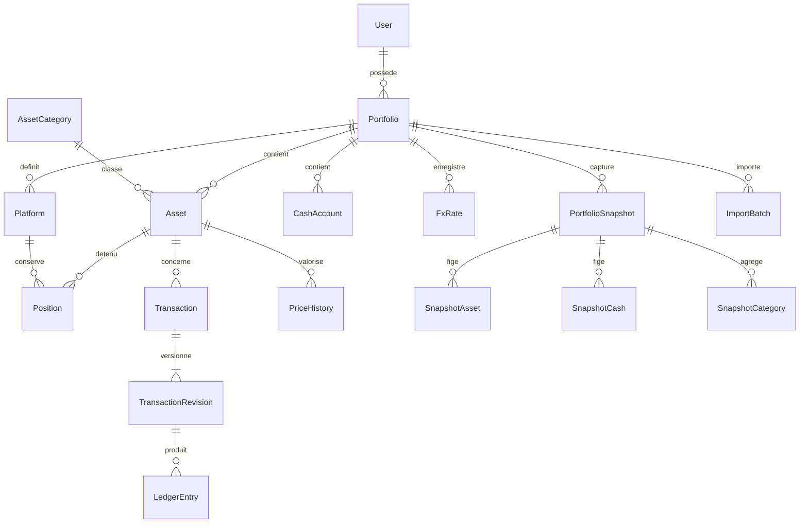

# Modèle de données cible

Ce document conserve le modèle cible de la conception initiale. Une base PostgreSQL et ses migrations existent maintenant : voir [le schéma Prisma réel](../prisma/schema.prisma) et [les simplifications de la version 0.1.0](implementation.md). Les invariants de calcul sont définis dans [calculations.md](calculations.md).

## Conventions

- Identifiants UUID générés côté serveur ; identifiants d'authentification compatibles avec le schéma de Better Auth.
- `createdAt`, `updatedAt` en `timestamptz` ; date effective d'une opération distincte de sa date d'enregistrement.
- Montants, prix, quantités et taux : `numeric(38,18)` ; entrées non finies et valeurs hors bornes rejetées. Précision de calcul interne 60 chiffres, arrondi explicite uniquement à la persistance ou à l'affichage.
- Monnaie : référence vers `Currency.code`, code ISO à trois lettres pour EUR et USD. Les cryptomonnaies sont des actifs, pas implicitement des monnaies de règlement.
- Toutes les tables financières portent `portfolioId`. Les relations sensibles utilisent des clés composites pour empêcher de référencer un actif, une plateforme ou un compte d'un autre portefeuille.
- `version` entier pour concurrence optimiste sur les ressources modifiables ; `ledgerVersion` entier sur le portefeuille pour le journal.
- Champs texte bornés : nom 120, référence 100, notes 5 000 caractères. URLs HTTPS limitées à 2 048 caractères.
- `deletedAt` reste présent pour les anciennes suppressions logiques. Une nouvelle suppression de fiche efface explicitement ses écritures, prix, image et captures qui la contiennent avant de supprimer l'actif ; les clés étrangères restent restrictives.

## Relations principales

`Asset` est une fiche de bien/instrument au sein du portefeuille, pas une ligne par achat. Plusieurs achats du même bien partagent une fiche. Une carte ou une pièce aux caractéristiques distinctes obtient une fiche séparée. `Position` distingue les lieux de conservation. Le coût moyen économique est calculé par actif sur l'ensemble de ses positions.

## Identité et références

| Entité | Champs principaux | Contraintes et index |
| --- | --- | --- |
| `User` | id, name, email, emailVerified, image?, createdAt, updatedAt | Email normalisé unique ; propriétaire du portefeuille |
| `Session` | Champs requis par Better Auth : userId, expiration, token et métadonnées limitées | Index userId et expiration ; jamais exportée |
| `Account` | Champs Better Auth, identité locale et hash de mot de passe | Contraintes de l'adaptateur ; aucun fournisseur financier |
| `Verification` | Champs Better Auth pour vérifications éventuelles | Schéma de la version installée, jamais exporté |
| `AuthRateLimit` | Clé opaque, fenêtre temporelle, compteur | Stockage partagé des tentatives ; rétention courte |
| `Portfolio` | id, ownerId, name, baseCurrency=EUR, displayCurrency=EUR, timezone, ledgerVersion, isDemo, createdAt | Index ownerId ; devise de base immuable après première écriture |
| `Currency` | code, name, symbol, displayDecimals, enabled | PK code ; seed EUR et USD |
| `AssetCategory` | id, portfolioId, key, label, kind, color, archivedAt? | Unique portfolioId + key ; `kind` sélectionne le schéma spécialisé |
| `Platform` | id, portfolioId, name, kind, notes?, archivedAt? | Unique portfolioId + nom normalisé ; aucune credential |
| `CashAccount` | id, portfolioId, platformId, currency, name, projectedBalance, version | Unique portefeuille + plateforme + devise ; devise immuable |

Catégories seed : crypto, métaux, actions/ETF, Pokémon, One Piece, autres. Les liquidités sont une catégorie de présentation réservée aux `CashAccount`, sans créer de faux actif négociable. Une nouvelle catégorie utilisateur de type `OTHER` ne nécessite pas de migration.

## Actifs, positions et métadonnées

### `Asset`

Champs : `id`, `portfolioId`, `categoryId`, `name`, `symbolOrReference`, `subcategory?`, `quoteCurrency`, `defaultPlatformId?`, `externalIdentifier?`, `notes?`, `status`, `version`, `createdAt`, `updatedAt`, `deletedAt?`.

- `status` : ACTIVE, SOLD ou ARCHIVED. SOLD est cohérent uniquement avec une quantité totale nulle ; une entrée de quantité réactive le statut. ARCHIVED masque une fiche de la liste courante, pas des calculs.
- `quoteCurrency` est aussi la devise de coût de l'actif au MVP ; sa modification est interdite après des transactions. Une transaction dans une autre monnaie conserve les conversions vers cette devise et vers EUR.
- `quantity`, `averageCost`, `currentPrice`, `purchaseDate` et `currentValue` sont des **champs de lecture dérivés**, pas des entrées modifiables directement. Le formulaire de création peut émettre une transaction initiale atomique.
- Index : `(portfolioId, categoryId, status)`, `(portfolioId, name)`, `(portfolioId, symbolOrReference)` ; la référence n'est pas globalement unique (variantes de cartes/pièces).

### Spécialisations 1:1

Toutes portent `assetId` unique et une relation contrôlée avec la catégorie. Une spécialisation étrangère au `kind` est rejetée. Le service contrôle la cohérence inter-tables dans la transaction ; les contraintes simples sont ajoutées en SQL.

| Table | Champs |
| --- | --- |
| `CryptoDetails` | symbol, network?, contractAddress?, stakingRate?, stakingNotes? |
| `MetalDetails` | metalType GOLD/SILVER/OTHER, purity, weightGrams, coinType?, year?, faceValue?, faceCurrency?, country?, pricingMode, premiumType?, premiumValue?, manualGramPriceHistoryId? |
| `SecurityDetails` | ticker, exchange?, instrumentType STOCK/ETF, isin?, brokerageNotes? |
| `CardDetails` | game POKEMON/ONE_PIECE, setName?, cardNumber?, language, condition, grade?, gradingCompany?, certificateNumber?, year?, referenceUrl? |
| `OtherDetails` | metadataSchemaVersion, metadata JSONB strictement validé et borné |

Le poids fin est `weightGrams × purity` et reste dérivé ; pureté dans ]0,1], poids strictement positif. Les dividendes sont des transactions, les frais de courtage appartiennent à leurs achats/ventes ; ils ne sont pas dupliqués dans les métadonnées.

### `AssetImage`

`id`, `portfolioId`, `assetId`, `storageKey`, `mimeType`, `byteLength`, `width`, `height`, `checksum`, `altText?`, `createdAt`. Fichier privé, accès via route autorisée. Index assetId et unicité de la clé de stockage. Le nom original est facultatif et n'est jamais utilisé comme chemin.

### `Position`

`id`, `portfolioId`, `assetId`, `platformId`, `quantity`, `allocatedCostQuote`, `allocatedCostBase`, `allocatedCostUsd?`, `projectionVersion`, `updatedAt`.

Unique `(portfolioId, assetId, platformId)` ; quantités non négatives. Le coût est alloué depuis le coût moyen global de l'actif à chaque reconstruction, avec gestion déterministe du résidu. La somme des positions retrouve exactement quantité et coût totaux. Un transfert entre plateformes ne change pas ce total.

### `AssetBalance`

Projection 1:1 : `assetId`, `portfolioId`, `quantity`, `remainingCostQuote`, `remainingCostBase`, `remainingCostUsd?`, `realizedGainBase`, `realizedGainUsd?`, `incomeBase`, `incomeUsd?`, `ledgerVersion`. Le coût moyen est dérivé par division. Un replay du journal doit reconstruire exactement ces valeurs ; elles ne sont jamais acceptées telles quelles depuis le client.

## Journal des transactions

### `Transaction`

Identité stable : `id`, `portfolioId`, `assetId?`, `type`, `currentRevision`, `status POSTED/VOID`, `version`, `source MANUAL/CSV/SEED`, `externalReference?`, `createdAt`, `updatedAt`.

Types : BUY, SELL, DEPOSIT, WITHDRAWAL, TRANSFER, FEE, DIVIDEND, REWARD, ADJUSTMENT. `assetId` est obligatoire pour les mouvements d'actif et les revenus associés ; il est nul pour un dépôt/retrait de liquidités ou un frais général.

Index : `(portfolioId, assetId)`, `(portfolioId, type)`. Unicité partielle `(portfolioId, source, externalReference)` quand référence non nulle ; les références CSV doivent être stables et identifiées par origine.

### `TransactionRevision`

`id`, `portfolioId`, `transactionId`, `revisionNumber`, `occurredAt`, `sequence`, `recordedAt`, `actorId`, `quantity`, `unitPrice?`, `grossAmount`, `fees`, `currency`, `feeCurrency`, `fxToQuote`, `fxToBase`, `fxToUsd?`, `fxSources`, `platformId?`, `destinationPlatformId?`, `cashAccountId?`, `destinationCashAccountId?`, `settlement`, `direction?`, `adjustmentKind?`, `carriedCost?`, `fairValue?`, `comment?`, `reason?`, `supersedesRevisionId?`, `voided`.

- Unique transactionId + revisionNumber ; index portefeuille + occurredAt + sequence. Le journal actif est trié par date effective et séquence serveur stable, jamais par date de modification.
- `grossAmount` est recomputé côté serveur (quantité × prix pour achat/vente). `fees` est non négatif ; frais dans la devise de règlement au MVP. Un frais dans un autre actif est une écriture liée distincte, pas un arrondi implicite.
- `settlement` : INTERNAL_CASH ou EXTERNAL_FUNDING pour un achat ; INTERNAL_CASH ou EXTERNAL_PAYOUT pour une vente. Le service génère les contreparties et flux nécessaires.
- Pour un transfert, source et destination distinctes, même portefeuille et même actif/devise ; toutes les jambes sont atomiques.
- Quantité positive selon le type ; ajustement signé non nul et motif obligatoire. Prix nul admis pour un actif sans valeur, jamais confondu avec prix absent.
- Un changement de `assetId` ou de type exige annulation puis nouvelle transaction liée, afin de garder la filiation claire.
- Les taux nécessaires aux coûts de cotation et EUR sont requis avant validation. Le taux historique USD est facultatif : s'il manque, les indicateurs de coût/gain USD dépendants restent indisponibles, sans empêcher la comptabilité EUR. Le saisir après coup exige une révision explicite, pas une réécriture silencieuse.

### `LedgerEntry`

Écritures techniques générées : `id`, `portfolioId`, `transactionRevisionId`, `entryKind`, `assetId?`, `platformId?`, `cashAccountId?`, `quantityDelta?`, `cashDelta?`, `costDeltaQuote?`, `costDeltaBase?`, `costDeltaUsd?`, `externalFlowBase?`, `externalFlowUsd?`, `incomeBase?`, `incomeUsd?`, `expenseBase?`, `expenseUsd?`, `flowOccurredAt`, `valuationSource?`.

Les champs présents dépendent de `entryKind` et sont contrôlés par CHECK. Le service seul les produit. Elles servent à reconstruire positions, trésorerie, apports/retraits et rendement sans compter deux fois un achat. Les révisions remplacées sont exclues du journal actif, conservées pour audit.

### `IdempotencyRecord`

`portfolioId`, `actorId`, `routeScope`, `key`, `requestHash`, `resourceId?`, `statusCode`, `createdAt` ; unicité sur portefeuille + acteur + route + clé. La clé et le résultat minimal sont persistés avec la mutation. Rejouer la même clé et le même contenu retourne la ressource originale ; contenu différent : 409. Les références d'import restent durables.

## Prix et taux de change

| Entité | Champs | Contraintes et index |
| --- | --- | --- |
| `PriceHistory` | id, portfolioId, assetId, price, currency, source, observedAt, fetchedAt, createdAt, supersedesId?, pricingInputs? | Prix ≥ 0 ; index `(assetId, observedAt DESC, createdAt DESC)` ; historique append-only |
| `MetalSpotPrice` | id, portfolioId, metalType, currency, pricePerFineGram, observedAt, source, createdAt | Prix ≥ 0 ; index portefeuille + métal + date ; aucune API requise |
| `FxRate` | id, portfolioId, fromCurrency, toCurrency, rate, observedAt, source, createdAt, supersedesId? | Taux > 0 ; index paire + observedAt ; unité explicitement « monnaie cible pour 1 monnaie source » |
| `PriceRefreshRun` | id, portfolioId, startedAt, finishedAt?, status, successCount, fallbackCount, missingCount | Index portefeuille + date |
| `PriceRefreshError` | id, runId, assetId, providerId, safeErrorCode, occurredAt | Codes contrôlés, aucun secret ni réponse brute |

Les paires EUR/USD peuvent être inversées par calcul décimal, avec conservation du taux source et de la direction utilisée. Un taux ne peut pas être utilisé avant sa date d'observation. Les coûts des transactions conservent une copie des taux réellement appliqués : une mise à jour FX ultérieure ne les change pas.

Le cache du prix courant est optionnel et reconstruisible. Il ne remplace jamais `PriceHistory`. Le JSON `pricingInputs` permet de conserver poids, pureté, prime et prix au gramme utilisés pour une valorisation métallique.

## Snapshots

### `PortfolioSnapshot`

`id`, `portfolioId`, `kind MANUAL/DAILY/SEED`, `capturedAt`, `localDate`, `timezone`, `ledgerVersion`, `calculationVersion`, `baseCurrency`, `totalBase?`, `totalUsd?`, `knownSubtotalBase`, `knownSubtotalUsd`, `remainingCostBase`, `remainingCostUsd?`, `realizedGainBase`, `realizedGainUsd?`, `incomeBase`, `incomeUsd?`, `cumulativeNetFlowsBase`, `cumulativeNetFlowsUsd?`, `quality COMPLETE/PARTIAL`, `metricAvailability`, `missingAssetCount`, `missingFxCount`, `createdAt`.

Unicité partielle portefeuille + localDate pour DAILY. Les snapshots MANUAL acceptent plusieurs captures par jour mais possèdent une clé d'idempotence par demande. Index `(portfolioId, capturedAt DESC)`.

### Lignes immuables

| Table | Données figées |
| --- | --- |
| `SnapshotAsset` | assetId, platformId, nom/référence/catégorie au moment de capture, quantity, costQuote, costBase, costUsd?, price?, quoteCurrency, priceHistoryId?, source?, observedAt?, fetchedAt?, fxToEur?, fxToUsd?, fxObservedAt?, valueEur?, valueUsd?, stale, quality |
| `SnapshotCash` | cashAccountId, currency, balance, taux utilisés et dates, valueEur?, valueUsd?, quality |
| `SnapshotCategory` | categoryId ou clé réservée liquidités, libellé figé, valueEur?, valueUsd?, knownSubtotal, remainingCostBase, remainingCostUsd?, unrealizedGainBase?, unrealizedGainUsd?, realizedGainBase, realizedGainUsd?, quality |

Chaque ligne porte snapshotId et portfolioId ; contraintes d'unicité par snapshot + position/compte/catégorie. Les libellés et valeurs sont copiés pour que renommer, archiver ou supprimer logiquement une fiche n'altère pas une ancienne capture. Les références financières sont en `RESTRICT`.

Le statut « historique corrigé après capture » est calculé à partir de `ledgerVersion`, des dates effectives et des révisions ultérieures ; il ne nécessite pas de modifier un ancien snapshot.

La disponibilité est précisée par indicateur et devise : une valeur actuelle USD peut être complète alors que son gain USD est inconnu faute de taux historique d'acquisition. Une catégorie contenant des actifs entièrement vendus conserve ses gains réalisés dans `SnapshotCategory` même si elle n'a plus de position détenue.

## Imports et audit

| Entité | Champs et rôle |
| --- | --- |
| `ImportBatch` | id, portfolioId, actorId, type ASSETS/TRANSACTIONS, schemaVersion, fileHash, normalizedPayload JSONB borné, validationResult, ledgerVersionAtPreview, status PREVIEW/COMMITTED/EXPIRED, expiresAt, committedAt?, resultIds |
| `ImportRow` | batchId, rowNumber, normalizedHash, externalReference?, action, targetId?, errors ; unique batch + ligne |
| `AuditLog` | id, portfolioId, actorId?, action, entityType, entityId, previousVersion?, nextVersion?, safeMetadata, occurredAt ; index portefeuille + date et entité + id |

Les lots d'aperçu expirent après 24 h et leur contenu temporaire est purgé. Les marqueurs de lots confirmés et les références restent pour l'idempotence. L'audit ne contient ni mot de passe, ni cookie, ni clé API. Les anciennes données d'une transaction restent dans ses révisions, pas dupliquées dans les logs.

## Invariants à implémenter et tester

1. Toute référence entre données personnelles reste dans le même portefeuille.
2. Un journal ne produit jamais une quantité ou une trésorerie négative, y compris lors d'un ajout antidaté.
3. Les lignes de transfert et leurs éventuels frais sont écrites ou annulées ensemble.
4. Les sommes des projections retrouvent le journal, et les sommes des lignes de snapshot retrouvent ses totaux.
5. Un achat avec frais incorpore ces frais une seule fois au coût ; une vente les retire une seule fois du produit net.
6. Modifier une transaction rejoue l'ensemble des écritures affectées ; une vente ultérieure impossible entraîne un rollback complet.
7. Aucune mutation de fiche ne change les quantités ou les coûts sans transaction correspondante.
8. Aucune modification de prix, de taux, de nom ou de catégorie ne modifie les snapshots déjà enregistrés.
9. Le total EUR/USD reste inconnu quand sa conversion est impossible ; les valeurs connues restent consultables.
10. Les contraintes SQL non exprimables en Prisma sont fournies explicitement par migrations relues : CHECK, uniques partielles et références composites.
